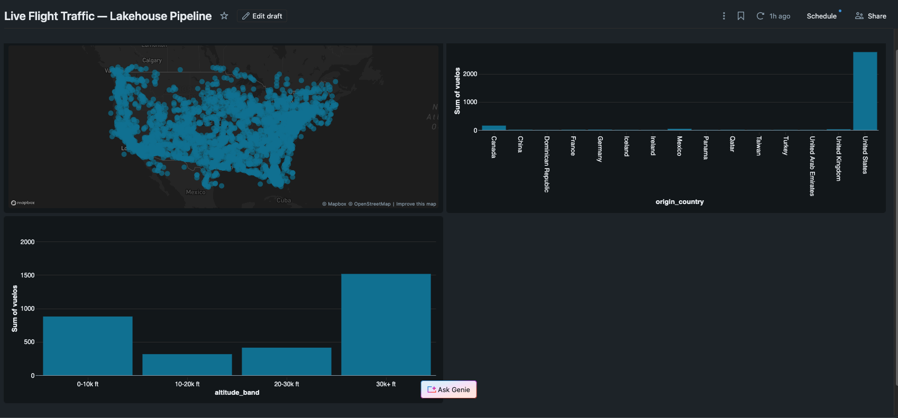
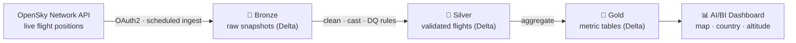
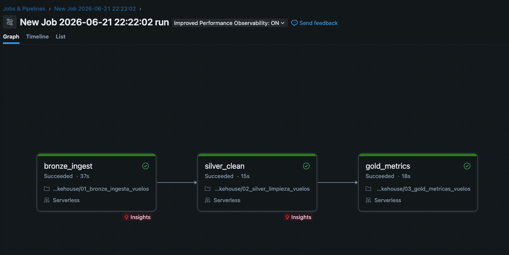

# ✈️ Live Flight Traffic — Lakehouse Pipeline on Databricks

A near-real-time data engineering pipeline that ingests live air-traffic data from the
**OpenSky Network**, processes it through a **medallion (Bronze → Silver → Gold)
lakehouse architecture** on **Databricks**, applies data-quality validation, runs as an
**automated, orchestrated job**, and serves the results through an interactive
**AI/BI dashboard**.

> The same kind of flight-position stream powers real logistics operations — port
> authorities coordinating ground ops, delivery services integrating flight schedules,
> and freight forwarders tracking cargo. This project mirrors that pattern end to end.


<!-- Replace with your published dashboard screenshot -->

---

## 🏗️ Architecture



The medallion pattern separates concerns cleanly: raw data is preserved (Bronze),
cleaned and standardized (Silver), then shaped into business-ready metrics (Gold).
Each layer is an independent, reproducible step.

---

## ⚙️ Orchestration

The three layers run as a **single multi-task Databricks Job** (Lakeflow), executed as a
DAG with task dependencies and a scheduled trigger — so the pipeline runs automatically
and accumulates a historical time series with no manual intervention.



`bronze_ingest → silver_clean → gold_metrics`, all on serverless compute.

---

## 🧰 Tech stack

| Layer         | Technology                                        |
|---------------|---------------------------------------------------|
| Platform      | Databricks (Free Edition, serverless compute)     |
| Storage       | Delta Lake on Unity Catalog                       |
| Processing    | PySpark                                           |
| Source        | OpenSky Network REST API (OAuth2)                 |
| Orchestration | Databricks Lakeflow Jobs (scheduled DAG)          |
| Secrets       | Databricks Secrets                                |
| Serving       | Databricks AI/BI Dashboards                       |

---

## 🔄 Pipeline layers

### 🥉 Bronze — `bronze_flights`
Ingests raw state-vector snapshots from the OpenSky API and lands them in a Delta table
**without transformation**. Each run appends a new snapshot, building a historical record.
Adds ingestion metadata (`snapshot_time`, `ingested_at`).

### 🥈 Silver — `silver_flights`
Cleans and standardizes the raw data:
- **Data-quality rules**: drops records without an aircraft id or a valid position
  (null coordinates, latitude/longitude out of range). Rejected counts are logged on
  every run.
- Normalizes `callsign` (trims whitespace, empty → null).
- Derives human-readable fields: real timestamps, altitude in feet, speed in km/h.
- Deduplicates on `(icao24, event_time)`.
- Rebuilt idempotently from Bronze on each run.

### 🥇 Gold — metric tables
Curated aggregates ready for the dashboard, each answering one question:
- `gold_country_traffic` — flights, average altitude & speed by origin country.
- `gold_altitude_bands` — distribution of flights across altitude bands.
- `gold_traffic_by_snapshot` — time series of aircraft in the air vs. on the ground.

---

## 📊 Dashboard

Built in Databricks AI/BI on top of the Gold tables:
- **Flight map** — live aircraft positions plotted by latitude/longitude.
- **Traffic by country** — bar chart of busiest origin countries.
- **Altitude distribution** — flights grouped by altitude band.

---

## 🧠 Engineering decisions worth noting

- **Orchestration over manual runs**: the pipeline is a scheduled multi-task job, not a
  set of notebooks run by hand — reproducible and hands-off.
- **Secrets, not hardcoded credentials**: OpenSky credentials live in Databricks Secrets;
  no keys are committed to the repo.
- **Idempotency**: Silver and Gold fully rebuild from upstream, so re-runs never produce
  duplicates or partial state.
- **Data quality as a first-class step**: invalid records are filtered and *counted*, not
  silently dropped — making quality measurable.
- **Schema is explicit**, not inferred, avoiding null-inference failures on sparse fields.
- **Cost-aware ingestion**: respects the OpenSky daily credit limit; a bounding box keeps
  snapshot volume reasonable on free-tier compute.

---

## ▶️ How to reproduce

1. Create a free **OpenSky Network** account and an **API client** (OAuth2 credentials).
2. Sign up for **Databricks Free Edition**.
3. Import the notebooks from `/notebooks` into your workspace.
4. Run `00_setup_secrets` once to store your OpenSky credentials in Databricks Secrets.
5. Run `01_bronze` → `02_silver` → `03_gold`, or create a Lakeflow Job that chains them.
6. Schedule the job and build the dashboard on top of the Gold tables.

---

## 🚀 Possible next steps

- Convert Silver/Gold into **Lakeflow Declarative Pipelines** with built-in expectations.
- Version the whole project with **Databricks Asset Bundles** + CI/CD.
- Add **incremental ingestion** and partitioning/optimization (`OPTIMIZE`, Z-ORDER).

---

## 📁 Repo structure

```
.
├── README.md
├── notebooks/
│   ├── 00_setup_secrets.py
│   ├── 01_bronze_ingesta_vuelos.py
│   ├── 02_silver_limpieza_vuelos.py
│   └── 03_gold_metricas_vuelos.py
└── docs/
    ├── dashboard.png
    └── dag.png
```

---

*Data source: [OpenSky Network](https://opensky-network.org/). Used for non-commercial,
educational purposes, with attribution per their terms of use.*
